# Kews: Kotlin Multiplatform News App

A modern cross-platform news application built with Kotlin Multiplatform, Clean Architecture, and
Compose Multiplatform UI. Powered by NewsAPI.org, Kews showcases best practices and a scalable,
modular architecture for Android, iOS.

---

## Quick Start

### Prerequisites

- **Android Studio** (latest stable, for Android/Desktop)
- **Xcode** (15+, for iOS)
- **Kotlin Multiplatform Mobile Plugin** (recommended)
- **Java 17 or higher**

### 1. Get NewsAPI Key

- Register for a free API key at [NewsAPI.org](https://newsapi.org/).

### 2. Configure Your API Key

Locate (or create) the file:

```
.configs/main/.secrets/secrets.properties
```

Add the following line (replace with your actual key):

```
news_api_key = <YOUR_NEWSAPI_KEY>
```

If the `.configs/main/.secrets/` directory doesn't exist, create it manually. Ensure
`secrets.properties` is **NOT** tracked by version control (add it to `.gitignore` if needed).

### 3. Build & Run

#### Android

1. Open the project in Android Studio.
2. Select the `app-android` run configuration.
3. Run on your device or emulator.

#### iOS

1. In a terminal, run `./gradlew :umbrella:syncFramework` to generate iOS frameworks.
2. Open `kews-ios/kews-ios.xcodeproj` in Xcode.
3. Select a simulator or device, then build/run.

#### Desktop (optional)

```
./gradlew :app-android:desktop:run
```

---

## Tech Stack

- **Kotlin Multiplatform (KMP)** – shared logic across platforms
- **Compose Multiplatform** – UI for Android/iOS/Desktop
- **Ktor** – networking
- **Koin** – dependency injection
- **BuildKonfig** – build config injection (API keys, settings)
- **Coil** – image loading
- **Decompose** – navigation & state
- **SQLDelight** *(future)* – offline cache

---

## Project Structure

```bash
├── app-android/               # Android app
├── compose-ui/                # Shared Compose UIs
├── core/                      # Shared core logic (network, db, settings)
├── data/                      # Data repositories & sources
├── domain/                    # Use cases & domain models
├── umbrella/                  # Shared umbrella module (entry point)
├── presentation-decompose/    # Navigation, ViewModels
├── util/                      # Utilities
├── kews-ios/                  # iOS app
└── .configs/main/.secrets/    # (your API keys – not committed)
```

---

## Clean Architecture Layers

- **Domain Layer**: Business logic, models, use cases
- **Data Layer**: APIs, repositories, DTOs, data sources
- **Presentation Layer**: Compose screens, ViewModels, DI
- **Core Utilities**: Network, database, platform-specific

### Detailed Architecture Diagram

```mermaid
flowchart LR
  User(("👤 User"))
  ComposeUI["📱 compose-ui"]
  VM["🛠️ presentation-decompose<br/>🛠️ presentation-voyager"]
  UC["⚙️ domain/news<br/>⚙️ domain/auth<br/>⚙️ domain/rss"]
  Repo["🏠 data/news<br/>🏠 data/auth<br/>🏠 data/rss"]
  CoreNet["🌐 core/network<br/>🔑 NEWS_API_KEY via DI"]
  CoreDB["💾 core/database"]
  NewsAPI(("🔗 NewsAPI.org"))

  User --> ComposeUI
  ComposeUI --> VM
  VM --> UC
  UC --> Repo
  Repo --> CoreNet
  Repo --> CoreDB
  CoreNet --> NewsAPI
```



---

## Features

- Browse top news headlines and search topics
- Article detail with full content, images, source info
- Open article in browser
- Share article link
- Modern Material 3 UI for all platforms
- Proper error/loading states

---

## Testing & Future Enhancements

- Unit tests and integration tests supported (sample tests may be added)
- Planned: offline mode, push notifications, bookmarks, advanced search filters

---

## License

Educational/demonstration purposes only. See [LICENSE](LICENSE).
